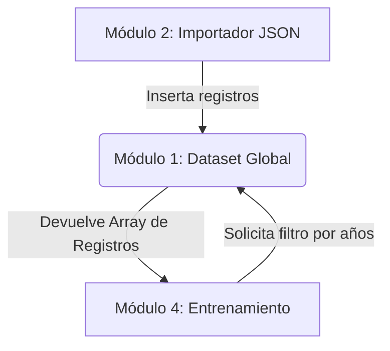

# Módulo 1: Almacenamiento y Gestión de Dataset

## 1. Propósito y Alcance
Este módulo es la capa más baja (Capa de Persistencia en Memoria) del sistema *FuzzyCiclones*. Su único propósito es definir la estructura anatómica de un día climático (`RegistroClimatico`), mantener el catálogo histórico en memoria RAM y proveer mecanismos rápidos de filtrado por fechas.

> [!NOTE]
> Su alcance está estrictamente limitado a la administración en memoria. No realiza operaciones matemáticas ni de lectura/escritura a disco.

---

## 2. Descripción General y Arquitectura
El módulo opera bajo un patrón de diseño **Singleton**. En lugar de asignar memoria dinámica (heap) mediante `malloc/free`, utiliza un gran arreglo estático global. 

**Flujo de Datos:**
1. Recibe inserciones desde el **Módulo 2 (Importador)**.
2. Es consultado por el **Módulo 4 (Entrenamiento)** cuando este necesita un subconjunto específico de años para entrenar el modelo.



---

## 3. Especificaciones y Explicación del Código

### 3.1 Estructura Principal (`RegistroClimatico`)
```c
typedef struct {
    char fecha[11]; // Formato "YYYY-MM-DD" + '\0'
    int anio;
    double sst;     // Sea Surface Temperature
    double presion; // Presion a nivel del mar
    // ... Otras variables
} RegistroClimatico;
```
**Descripción:** La estructura atómica de datos. Mantiene la fecha formateada para visualización y extrae numéricamente el `anio` para permitir filtros ultra-rápidos sin necesidad de parsear el string en cada búsqueda.

### 3.2 Almacenamiento Global
```c
static RegistroClimatico g_dataset[MAX_REGISTROS];
static int g_cantidad_registros = 0;
```
**Descripción:** El almacén estático `g_dataset` encapsula todos los datos. La variable `g_cantidad_registros` actúa como el puntero de fin de archivo (cursor), indicando cuántos días reales han sido cargados.

### 3.3 Función: `dataset_agregar`
```c
int dataset_agregar(const RegistroClimatico* reg) {
    if (g_cantidad_registros >= MAX_REGISTROS) return -1; // Overflow
    g_dataset[g_cantidad_registros] = *reg; // Copia por valor
    g_cantidad_registros++;
    return 0;
}
```
**Descripción:** Intenta insertar un nuevo registro. Garantiza que la aplicación nunca sobrepase los límites de memoria física permitidos (`MAX_REGISTROS`), retornando una excepción (`-1`) si ocurre.

### 3.4 Función: `dataset_filtrar_por_anio`
```c
int dataset_filtrar_por_anio(int anio_inicio, int anio_fin, RegistroClimatico* buffer_salida, int max_salida) {
    int cont = 0;
    for (int i = 0; i < g_cantidad_registros; i++) {
        if (g_dataset[i].anio >= anio_inicio && g_dataset[i].anio <= anio_fin) {
            if (cont >= max_salida) break;
            buffer_salida[cont++] = g_dataset[i];
        }
    }
    return cont;
}
```
**Descripción:** Actúa como un motor de consultas (Query Engine). Recorre secuencialmente todo el catálogo buscando días que coincidan con la ventana de tiempo. Los aciertos se copian al `buffer_salida` proporcionado por el invocador.

---

## 4. Justificación Técnica: ¿Por qué debe ser así?

> [!IMPORTANT]
> **Decisión Arquitectónica: Asignación Estática vs Asignación Dinámica**

Cualquier programador moderno sugeriría usar `malloc()` o `std::vector` para manejar la lista de registros y evitar un límite duro como `MAX_REGISTROS`. 

**Razón para no hacerlo (El Por qué):** 
Este código fue diseñado para ser compilado en **WebAssembly (WASM)** y correr directamente en el hilo del navegador web de los usuarios. En WebAssembly, el heap dinámico y el Garbage Collector (si aplica) son frágiles y lentos en el cruce de fronteras entre C y JavaScript.

Al forzar un tamaño estático conocido en tiempo de compilación (ej. 2000 registros):
1. El compilador `emcc` empaca exactamente la cantidad necesaria de bytes lineales en el archivo `.wasm`.
2. Evitamos memory leaks severos (no hay que preocuparse por llamar a `free()` desde el frontend).
3. Maximizamos el caché del procesador mediante localidades de memoria contiguas.