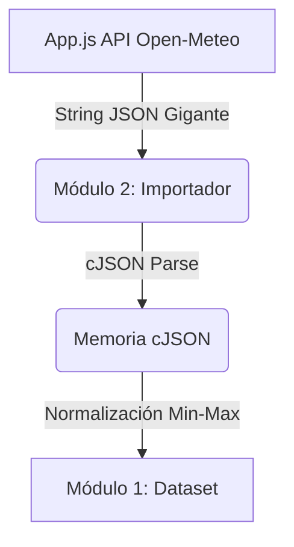

# Módulo 2: Importador y Parseo de Datos

## 1. Propósito y Alcance
El Módulo 2 es la Capa de Ingesta de Datos (Data Ingestion) del proyecto *FuzzyCiclones*. Su función principal es recibir secuencias en texto plano (en formato JSON estructurado) provenientes del Frontend/API, decodificarlas, normalizarlas matemáticamente y enviarlas al Módulo 1 para su almacenamiento.

> [!NOTE]
> Este módulo no toma decisiones matemáticas ni entrena modelos; es estrictamente un traductor/limpiador de datos.

---

## 2. Descripción General y Arquitectura
Este módulo hace un uso extensivo de la librería externa de C `cJSON` para leer árboles estructurados de texto. 

**Flujo de Datos:**
1. Recibe un string JSON masivo directamente desde Javascript (vía el Bridge).
2. Usa `cJSON_Parse` para convertir el string a una estructura en memoria (C struct).
3. Itera sobre los arreglos de variables climáticas (temperatura, presión, lluvia).
4. Aplica "Min-Max Normalization" para dejar las métricas entre 0 y 1.
5. Inyecta cada día climático en el Módulo 1.



---

## 3. Especificaciones y Explicación del Código

### 3.1 Normalización Min-Max Constante
```c
static const double MIN_SST = 20.0, MAX_SST = 35.0;
static const double MIN_PRESION = 950.0, MAX_PRESION = 1030.0;

double normalize(double val, double min_v, double max_v) {
    if (val < min_v) return 0.0;
    if (val > max_v) return 1.0;
    return (val - min_v) / (max_v - min_v);
}
```
**Descripción:** El algoritmo Fuzzy C-Means falla estrepitosamente si evalúa presiones atmosféricas en miles (ej. 1013 hPa) compitiendo con temperaturas de mar en veintenas (ej. 28 °C). La presión dominaría completamente la métrica de distancia euclidiana. La función `normalize` escala todas las variables para que midan exactamente de `0.0` a `1.0`.

### 3.2 Deserialización de JSON
```c
cJSON *json = cJSON_Parse(json_string);
cJSON *daily = cJSON_GetObjectItem(json, "daily");
cJSON *time_arr = cJSON_GetObjectItem(daily, "time");
```
**Descripción:** Mapea el árbol JSON. `cJSON_Parse` lee carácter por carácter y crea una estructura navegable. Es vital para entender las respuestas crudas que manda el servidor de Open-Meteo.

### 3.3 Extracción y Guardado Cíclico
```c
int num_days = cJSON_GetArraySize(time_arr);
for (int i = 0; i < num_days; i++) {
    RegistroClimatico reg;
    // ... se extraen strings y doubles del cJSON_ArrayItem
    reg.sst = normalize(sst_val, MIN_SST, MAX_SST);
    dataset_agregar(&reg);
}
```
**Descripción:** El núcleo de la ingesta. Por cada elemento en la matriz de fechas, se extraen las métricas, se pasan por el embudo de normalización y se empaquetan en un `RegistroClimatico` que el Módulo 1 almacena.

---

## 4. Justificación Técnica: ¿Por qué debe ser así?

> [!WARNING]
> **Decisión Arquitectónica: Delegar el Parseo JSON al Backend en C en lugar del Frontend JS**

**Escenario Alternativo:** JavaScript es el lenguaje nativo para procesar JSON. Era infinitamente más fácil hacer un `JSON.parse()` en `app.js` y pasar los valores numéricos ya sueltos a WebAssembly.

**Razón para hacerlo en C (El Por qué):** 
Aunque en JS es trivial, hacerlo en C asegura que el **Motor de Ingesta sea autónomo**. Si el día de mañana deseamos desechar WebAssembly y compilar este programa como un binario instalable (`.exe`) para correr en un servidor de línea de comandos, el Módulo 2 ya posee todo lo necesario para leer archivos de texto locales sin depender de un navegador o motor JS. Esto asegura la **Alta Cohesión** y la portabilidad del código de C.
